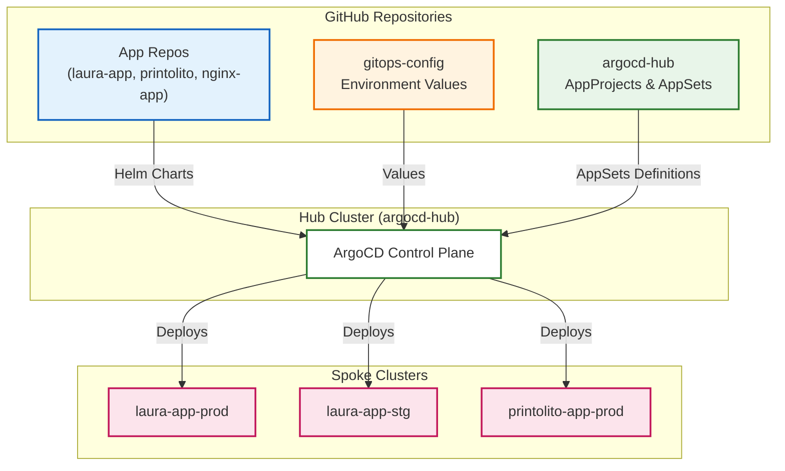

# ArgoCD PoC Infrastructure Repository

## Architecture Overview



This repository contains all the infrastructure-as-code (IaC) and auxiliary files used to create the Proof of Concept (PoC) for a Hub-and-Spoke ArgoCD deployment.

## 📦 Contents

| Directory/File | Description |
| :--- | :--- |
| `cluster-configs/` | Kind cluster configuration files for the hub and spoke clusters. |
| `kubeconfigs/` | Exported kubeconfig files for the spoke clusters (used to create ArgoCD cluster secrets). |
| `cluster-secrets/` | Pre-generated Kubernetes Secret manifests for registering spoke clusters with the ArgoCD Hub. |
| `argocd-manifests/` | Contains the ArgoCD installation manifest and CRD workarounds. |

### 🟢 Greenfield Deployment Note (printolito-app-prod files)
Included in this repository are the configuration (`cluster-configs/printolito-app-prod-cluster.yaml`) and registration secret (`cluster-secrets/printolito-app-prod-secret.yaml`) for the `printolito-app-prod` cluster.
- **Are they needed for a greenfield deployment?** **Yes.** If you are spinning up this environment from scratch locally, you must apply the `printolito-app-prod-cluster.yaml` configuration to provision the `kind` cluster with the correct `fs.inotify.max_user_instances=8192` limits to prevent `kube-proxy` crashes. You then must apply the `printolito-app-prod-secret.yaml` to the Hub cluster so ArgoCD knows how to deploy to it.
- **Warning:** The secret file contains plaintext TLS certificates and tokens used specifically for this local PoC. In a real-world production greenfield scenario, you would dynamically generate this secret using an IaC tool (like Terraform) or a Secret Manager, rather than committing it to Git.
| `argocd-architecture.html` | High-fidelity, interactive architecture diagram of the Hub-and-Spoke model. |
| `argocd-deployment-plan.md` | Detailed deployment plan explaining the architecture, responsibilities (RACI), etc. |
| `poc_summary.md` | Concise summary of the PoC, including requirements, architecture, issues encountered. |

## 🔧 How to Use This Repo

### Recreating the PoC Clusters
1. **Kind Clusters**: Use the files in `cluster-configs/` to create the hub and spoke clusters:
   ```bash
   kind create cluster --name argocd-hub --config cluster-configs/hub-cluster.yaml
   kind create cluster --name laura-app-prod --config cluster-configs/prod-cluster.yaml
   kind create cluster --name laura-app-stg --config cluster-configs/stg-cluster.yaml
   kind create cluster --name printolito-app-prod --config cluster-configs/printolito-app-prod-cluster.yaml
   ```
   (Adjust cluster names as desired.)

2. **Export Kubeconfigs** (if not already done):
   ```bash
   kubectl config view --context kind-laura-app-prod > kubeconfigs/prod-kubeconfig.yaml
   kubectl config view --context kind-laura-app-stg > kubeconfigs/stg-kubeconfig.yaml
   kubectl config view --context kind-printolito-app-prod > kubeconfigs/printolito-app-prod-kubeconfig.yaml
   ```

3. **Create Cluster Secrets** in the ArgoCD namespace on the hub cluster:
   - Use the files in `cluster-secrets/` as templates, or create them manually:
     ```bash
     kubectl --context kind-argocd-hub create secret generic laura-app-prod-secret \
       --namespace argocd \
       --from-file=config=cluster-secrets/prod-cluster-secret.yaml \
       --label "argocd.argoproj.io/secret-type=cluster"
     ```
   (Repeat for staging.)

### Understanding the Architecture
- Open `argocd-architecture.html` in a browser to view the Hub-and-Spoke diagram.
- Read `argocd-deployment-plan.md` for a deep dive into the design, responsibilities (RACI), and how this integrates with IaC.
- See `poc_summary.md` or `poc_summary.html` for a quick summary and lessons learned.

## 📚 Related Repositories in the `testing-org-egarciam` Org

| Repository | Purpose |
| :--- | :--- |
| `laura-app`, `printolito`, `nginx-app` | Application source repos (The "What") — contains the Helm chart for the Laura app. |
| `gitops-config` | Environment config repo (The "Where") — contains environment-specific values (e.g., `values/laura-app/prod.yaml`). |
| `argocd-hub` | Hub management repo (The "How") — contains the `AppProject` and `Application` manifests. |
| `argocd-poc-infra` | This repo — infrastructure and auxiliary files for the PoC. |

## Workload Namespace Convention

Application workloads must deploy to an app-owned namespace by default, never to `default` unless the exception is explicitly documented in the hub configuration.

Current workload namespaces:

| Application | Namespace |
| :--- | :--- |
| `laura-app` | `laura-app` |
| `nginx-app` | `nginx-app` |
| `printolito` | `printolito-app` |

## 🛠️ Notes and Troubleshooting

- During the PoC, we encountered an issue with the `applicationsets.argoproj.io` Custom Resource Definition (CRD) exceeding the Kubernetes API server's metadata size limit (262KB). As a workaround, we used explicit `Application` manifests instead of an `ApplicationSet`. The various `appset_crd*.yaml` files show our attempts to fix the CRD by stripping annotations.
- The `fixed_secret.yaml` and `tmp_secret.yaml` files are artifacts from troubleshooting the creation of ArgoCD cluster secrets.

## 🔄 How to Extend or Reuse

- To add a new application (e.g., "payment-app"):
  1. Create a new source repo (e.g., `payment-app`) with a Helm chart.
  2. Add environment values to `gitops-config/values/payment-app/` (e.g., `prod.yaml`, `stg.yaml`).
  3. Add `Application` manifests to `argocd-hub` pointing to the new repo and values.
- To add a new spoke cluster:
  1. Provision the cluster (e.g., via Terraform/Terragrunt in GCP).
  2. Create a ServiceAccount and export its kubeconfig.
  3. Create a Secret in the `argocd` namespace on the hub cluster (labelled `argocd.argoproj.io/secret-type: cluster`).
  4. Ensure the `AppProject` in `argocd-hub` allows the cluster as a destination (or uses a wildcard with namespace restrictions).

---
*This repository is a companion to the application and configuration repos, providing everything needed to bootstrap the infrastructure for the ArgoCD Hub-and-Spoke PoC.*
