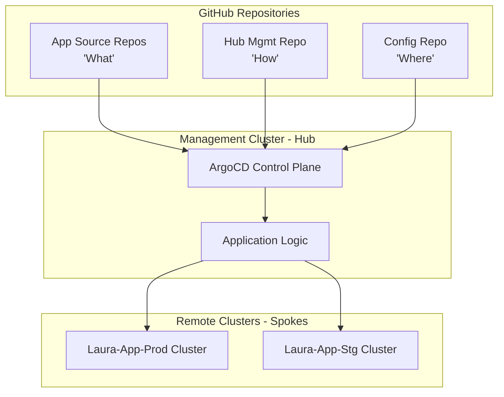

# PoC Summary: Multi-Cluster ArgoCD Hub-and-Spoke Deployment

## 1. Executive Summary
This Proof of Concept (PoC) demonstrates a centralized GitOps control plane using ArgoCD to manage workloads across multiple remote Kubernetes clusters (Spokes) using a strategic three-repository approach.

## 2. Requirements & Objectives
- **Centralized Governance:** A single "Hub" to manage multiple "Spoke" clusters.
- **Environment Isolation:** Separate state for Production and Staging.
- **Multi-Repo Strategy:** Decouple application code (What), deployment logic (How), and environment state (Where).
- **Least Privilege:** Ensure tenant teams can only manage their own application configurations.

## 3. Architecture
The system utilizes a **Hub-and-Spoke Architecture**.

### Repository Model
1. **App Repos (e.g., `nginx-app`, `payment-app`)**: Contain the source code and base Helm charts.
2. **Hub Repo (`argocd-hub`)**: Contains the `AppProject` (RBAC) and `Application` definitions.
3. **Config Repo (`gitops-config`)**: Contains environment-specific `values.yaml` (e.g., `prod.yaml`, `stg.yaml`).

### Flow Diagram

## 4. Implementation Details
- **Hub:** `argocd-hub` (Kind Cluster)
- **Spokes:** `laura-app-prod`, `laura-app-stg` (Kind Clusters)
- **Workload:** Nginx-based application "Laura".
- **Registration:** Spokes registered via `argocd.argoproj.io/secret-type: cluster` secrets.

## 5. Issues Encountered & Resolutions
| Issue | Cause | Resolution |
| :--- | :--- | :--- |
| **CRD Size Limit** | `applicationsets.argoproj.io` metadata exceeded 262KB. | Switched to explicit `Application` manifests for the PoC to bypass the bloated stable manifest. |
| **Auth Failures** | Git push required tokens in WSL. | Used `gh auth token` to inject credentials into remote URLs. |
| **Kind Provisioning** | Orphaned nodes from timeouts. | Implemented a clean-slate deletion before recreating clusters. |

## 6. Future Roadmap (Production Grade)
- **Sops Encryption:** To secure secrets in the Config repo.
- **ApplicationSets:** Using Git Generators for auto-onboarding.
- **IaC Handshake:** Automating cluster registration via Terraform.
